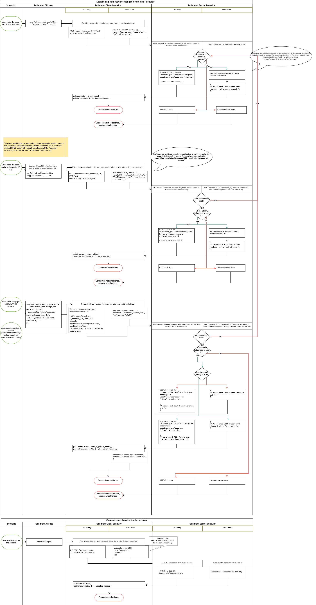

# Session

⚠️ This pages does not describe the current state but desired behaviour to be achieved in future releases

-------

## Questions to be answered first:
1. Do we care about the non-WebSocket scenario?

   Given limited resources, YAGNI and wide support across browsers (https://caniuse.com/#search=websocket), I vote to drop it.

2. Do we care about the scenario where client cached only session ID, but not the session state?

   To simplify workflow and architecture I suggest, not. If we are capable of caching one we should be able to cache the other.

-------


Palindrom is a library to improve performance and developer experience when syncing/collaborating on JSON document between separated peers (client and server). It's built on top of well-established standards: JSON, JSON-Patch, WebSockets, HTTP and REST. Palindrom flow should be implementable on any server that supports HTTP, JSON and REST. When WebSocket is not available, it falls back to REST calls over HTTP.

User session could be represented also as a REST resource. Then session management is no longer bound to palindrom internal implementation but is up to the consumer of Palindrom API. That way Palindrom serves for both stateful and stateless scenarios.

Consider you app to operate at `https://www.example.com/app`, then `https://www.example.com/app/sessions/aW3dAD472hAF12Q` could be consider RESTlike in classical sense, and could be given as `remoteURL` to Palindrom:

1. `GET /app/sessions/aW3dAD472hAF12Q` should return full JSON tree, if server still keeps that session alive,
2. `DELETE /app/sessions/aW3dAD472hAF12Q` should request deleting the session,
3. `POST /app/sessions` should request a new session,
4. `PATCH /app/sessions/aW3dAD472hAF12Q` should update session data.

Naturally, 4th one is the one we will use most often, to send JSON-Patches to update document tree.


Moreover, patch to deeper node of document, like:
```http
PATCH /app/sessions/aW3dAD472hAF12Q HTTP/1.1
Accept: application/json-patch+json
Content-Type: application/json-patch+json

[
 {"op":"replace","path":"/Recipient/0/Name","value":"Arthur"}
]
```
could be interpreted as a regular REST call:
```http
PUT /app/sessions/aW3dAD472hAF12Q/Recipient/0/Name HTTP/1.1
Accept: text/plain
Content-Type: text/plain

Arthur
```


-------------

## Creating a new user session with Palindrom


> Please note that to be able to read `Location` header you must enable it in your CORS policy, alternatively you can expose `X-Location` custom header which would be used by Palindrom as well.


----------

## Keeping session alive

Palindrom does not use any heart beating inside. It's up to the consumer of Palindrom API on the client or server to decide how long it should be kept, or whether the client should ping the server periodically. Palindrom will expose `.ping()/pong()` API and set of events, which will make it easy to implement heart beating if needed for specific customer case.

-----------

## Palindrom connection flow diagram
[](./img/Palindrom_Session.drawio)
> You can open it with [draw.io](https://www.draw.io/)